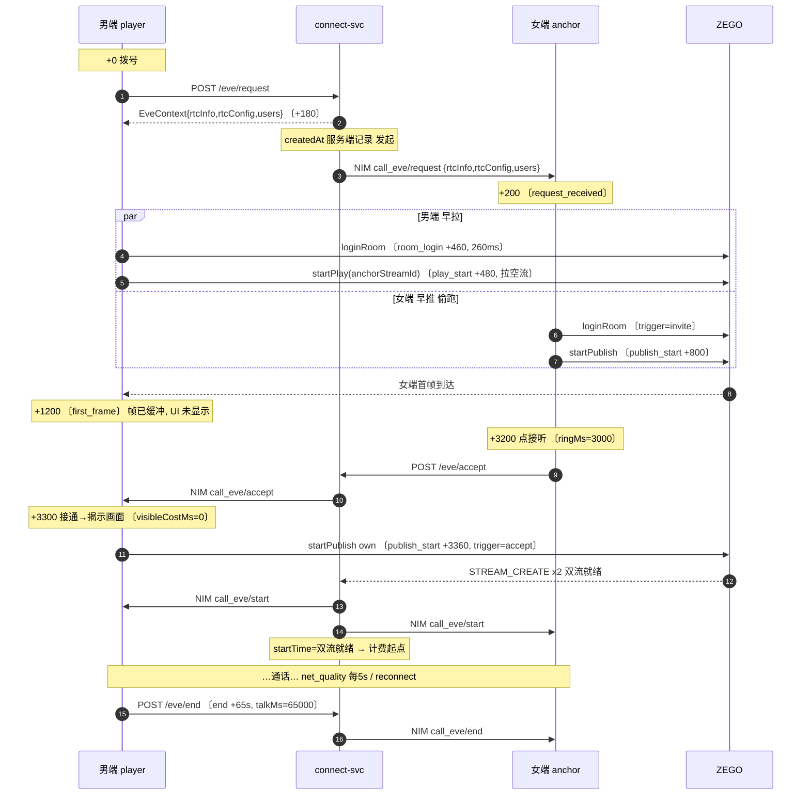
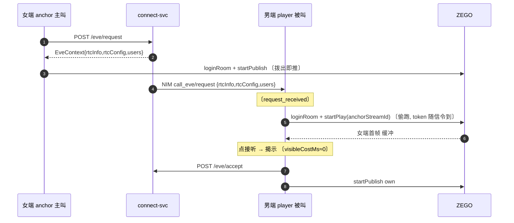

# RTC 1v1 通话 — 消息结构 / 男端秒开 / 埋点方案

> 设计规范。信令对齐权威实现 borders `biz-borders-call`(参考原版 eve `eve-chat`/`eve-admin`),并已核对我们当前 xchat `biz-connect-svc` + eve-webapp 的现状。

---

## 0. 目标

1. **男端秒开(两个方向都成立)**:男端(付费用户)最快看见女端画面首帧。规则按**性别角色**走,不按谁拨号 —— **女端(anchor)尽早把画面推出来,男端(player)尽早把画面拉进来,男端自己的画面最后才推**。
2. **补埋点**:打通「收到来电通知 → 推流 → 拉流 → 首帧」等关键点位,算出首帧耗时等 KPI;客户端只补服务端拿不到的点位。
3. **统一消息结构**:信令用 `call_eve/*`,载荷对齐 borders。

---

## 1. 角色与传输

> **角色由性别定,不由方向定**(同 borders:按 gender 定 player/anchor)。男女都能主叫,但付费方恒为男(player)、被看方恒为女(anchor)。

| 角色 | 说明 |
|---|---|
| 男端 / player | 付费方,**秒开 KPI 主体**;早拉女端流、自己的流接通后才推 |
| 女端 / anchor | 主播;永远早推流(主叫拨出即推 / 被叫收到来电即推) |
| connect-svc | 编排(发起/接听/挂断)、签 ZEGO token、计费、经 NIM 发信令 |
| ZEGO | 媒体云(音视频流) |
| 网易云信 NIM | **信令通道**——后端经 NIM 自定义系统通知把信令转给对端 |

**信令传输**:网易 `msg/sendAttachMsg.action`(静默系统通知,带推送)。

---

## 2. 消息结构(信令)

### 2.1 信令类型(定稿,双向通用)

`call_eve/{request, accept, reject, cancel, start, end, interrupt, cost}`:

| type | 方向 | 含义 |
|---|---|---|
| `call_eve/request` | 主叫→被叫 | 来电邀请(响铃) |
| `call_eve/accept` | 被叫→主叫 | 接听 |
| `call_eve/reject` | 被叫→主叫 | 拒接 |
| `call_eve/cancel` | 主叫→被叫 | 响铃中取消 |
| `call_eve/start` | 服务端→双方 | 双流就绪、通话开始(计费起点) |
| `call_eve/end` | 服务端→双方 | 正常结束 |
| `call_eve/interrupt` | 服务端→双方 | 异常中断 |
| `call_eve/cost` | 服务端→男端 | 每步计费通知 |

### 2.2 信封与载荷(权威结构 borders)

**信封**(网易 MessageBody):
```jsonc
{
  "messageId": "<uuid>",
  "type": "call_eve/request",
  "option": { /* SystemMessageOption:roaming/push/pushContent... */ },
  "data": { /* EveRespContext */ }
}
```

**data = EveRespContext**:
```jsonc
{
  "eveRecord":   { /* 通话记录(见下) */ },
  "playerUser":  { /* EveMiniUser 付费方 */ },
  "anchorUser":  { /* EveMiniUser 接收方 */ },
  "rtcConfig":   { /* 媒体编码配置 —— 定义初始视频质量 */ },
  "rtcInfo":     { /* ZEGO token + streamId */ },
  "settlementInfo": { /* 收益预览 */ },
  "properties":  { "chatHiddenSeconds": 30000, ... }
}
```

**rtcInfo**:`{ "playerToken", "playerStreamId", "anchorToken", "anchorStreamId" }`,streamId 格式 `{rtcRoomId}_{userId}`。

**rtcConfig(初始视频质量)**:`video{videoFPS:15, videoBitrate:1000, captureResolution:"540p", encodeResolution:"540p", codecID:"H.264"}` / `audio{codeID:"Low3", bitrate:18, channel:"Mono"}` / `traffic{traffics:[Basic,AdaptiveFPS,AdaptiveResolution], minVideoFps:8, focusOn:"...FOUNS_ON_REMOTE"}`。

**EveRecord 关键字段**:`id, rtcRoomId, fromUserId, toUserId, playerUserId, anchorUserId, acceptStatus(0未接/1已接/2拒), status(0待接/1通话/2结束/3结算/4异常), startTime, finishTime, duration, freeDuration, billStartTime, billStepCount, billStepSeconds, finishType, eveOriginalPrice, eveActualPrice, paymentActualCallAmount, incomeCallAmount, settlementStatus, type("Video"/"Match"), scene("none"/"live"), recordUrl`。

**枚举**:
- `CallStatus`:0 待接通 / 1 通话中 / 2 结束 / 3 结算 / 4 异常 / -1 未接通
- `FinishType`:1 未接通 / 2 主叫挂 / 3 被叫挂 / 4 余额不足 / 5 取消 / 6 拒接 / 7 接听超时 / 8 封禁 / 100+ 房间登出(100+RoomExitType)/ 200+ 流关闭(200+StreamCloseType)
- `RoomExitType`:0 正常 / 1 业务心跳超时 / 2 网关超时 / 3 后台踢 / 4 token 过期
- `StreamCloseType`:0 正常 / 1 心跳超时 / 2 异地登录 / 3 接口踢 / 4 TCP 断 / 5 房间销毁
- `type`:Video(视频)/ Audio(音频)
- **房间号**:`call_eve_{cc|bc}_{type}_{anchorId}_{playerId}_{ts}`(cc=男发起 / bc=女发起);**streamId** = `{roomId}_{userId}`

### 2.3 现状与对齐(connect-svc)

| 维度 | 权威(borders) | 现状(xchat) | 对齐动作 |
|---|---|---|---|
| 信令命名 | `call_eve/request…` | `eve_invite…` | 改为 `call_eve/*` |
| 信令 payload | rtcInfo + rtcConfig + 双方 user | 薄 `{eveId, rtcRoomId(invite), fromUserId(invite), duration(finish)}` | **`call_eve/request` 补齐为完整 `EveRespContext`(rtcInfo + rtcConfig + 双方 user)** |
| 信令类型 | 含 `start/interrupt/cost` | 有 start/finish,无 cost | 按需补 `cost`(展示扣费) |
| finishType | 细分 | 子码 | 按需对齐细分,便于归因 |

> **为什么补齐 payload**:① `rtcInfo` 含双方 token + streamId → 被叫收到来电即可直接偷跑入房(免去再调 `/accept` 换 token);② `rtcConfig` **定义初始视频质量**(分辨率/码率/帧率),双方一拿到信令就按它建流;③ 双方 user 便于来电页直接渲染(头像/昵称/等级),省一次拉取;④ 为后续扩展留位。`EveContext` 已用确定式 `streamId = {rtcRoomId}_{userId}`(推导/下发皆可),现状细节见 §4.5。

---

## 3. 推拉流时机与男端秒开(双向对称)

### 3.1 核心原则(按角色,不按方向)
- **女端(anchor)永远「早推流」**:作为主叫,**拨出即推**;作为被叫,**收到来电通知即推**。她不等对端,先把画面送上 ZEGO 云。
- **男端(player)永远「早拉、晚推」**:进入通话就拉女端流(主叫拨出即拉 / 被叫收到来电即拉);**自己的上行流接通后才推**,不阻塞首帧。
- 结果:无论谁拨,男端都最先把女端画面拉出来 → **男端秒开**。

> 一句话:**女的尽早把画面推出来,男的尽早把画面拉进来,男的自己的画面最后再推。**

> **⚠️ 实现口径(易混,踩过坑)**:connect-svc 数据模型里 `playerUserId = 主叫(fromUserId)`、`anchorUserId = 被叫(toUserId)` —— 代码中的 **player/anchor 实为「主叫/被叫」,不是性别**。常见场景「男拨女」恰好 player=男主叫、anchor=女被叫而重合;但「女拨男」时 player=女(主叫)、anchor=男(被叫)。**eve-webapp 用户恒为男(秒开主体)**,所以本端实现不按 player/anchor 分推拉时机,而是统一「**早拉对端、晚推自己(接通后)**」;`streamId` 选择仍用主叫/被叫区分(主叫推 `playerStreamId`/拉 `anchorStreamId`,被叫反之)。「女端 anchor 早推」是**主播端 app** 的职责,不是本 webapp。

### 3.2 时序 A:男拨女(男主叫)
```
男端(player): 拨号 call_eve/request ─► 拿 room + 推导 anchorStreamId
              └─ 入房 ─► 立即 startPlay(anchorStreamId)        ← 秒拉(允许拉空流,空挂等帧)
女端(anchor): 收到 call_eve/request ─► 后台入房 + 立即 startPublish     ← 早推
              └─ 点接听 → call_eve/accept
男端: 收到女端首帧 onPlayerRecvVideoFirstFrame                  ← 男端秒开(KPI 终点)
       接通后 ─► startPublish 自己的流(女看男,不阻塞男端首帧)
```

### 3.3 时序 B:女拨男(女主叫,对称)
```
女端(anchor): 拨号 call_eve/request ─► 入房 ─► 立即 startPublish        ← 拨出即推(她是 anchor)
男端(player): 收到 call_eve/request ─► 后台入房 + 立即 startPlay(anchorStreamId)  ← 早拉
              └─ 点接听 → call_eve/accept
男端: 收到女端首帧 onPlayerRecvVideoFirstFrame                  ← 男端秒开(KPI 终点)
       接通后 ─► startPublish 自己的流
```
> **隐私取舍**:女端在 accept 前就推流时,拉方(男端)虽在拉流,但 **UI 在收到 `call_eve/accept` 前不渲染对端画面**(仅缓冲),接通即揭示。若仍有顾虑,可改为「接听后再推」(秒开降级为 ~400ms)。计费始终以 `call_eve/start`(双流就绪)为准,与推流时机解耦。

### 3.4 依赖
1. **ZEGO 控制台开「允许拉空流」**:拉方在推方推流前就 `startPlay(streamId)`,服务器把空连接挂着,对端一推帧立即到。未开只能等 `roomStreamUpdate` 兜底(慢一个建连)。两方向都依赖。
2. **`call_eve/request` 信令带完整 payload(`EveRespContext`)**:`rtcInfo`(含双方 token + streamId)让被叫**收到来电即可直接偷跑入房/推/拉**,无需再调 `/accept` 换 token;`rtcConfig` 让双方按统一的初始视频质量建流。这是双向偷跑的前提(主叫本就从 request 响应拿到自己的 token/streamId)。
3. **男端推流后置**:`publishLocal` 放在 `startPlay` 之后(纯前端可调),且应在 `accept` 后**立即**推,避免拖慢服务端 `startTime`(双流就绪)与计费起点。

> **两方向落地差异**:**Flow A 男拨女** —— 男端是主叫,request 响应已有 token + anchorStreamId,只差 ① 允许拉空流即可秒拉,女端 accept 时推流即可。**Flow B 女拨男** —— 男端是被叫,偷跑预入房依赖 ② 的完整 payload(token 随 `call_eve/request` 到),补齐后即可 <500ms。

### 3.5 KPI 定义
- **男端可见耗时(秒开核心,工程口径)** = 画面显示时刻 − 本端接通时刻 = `first_frame.visibleCostMs`。预拉命中时帧已就绪,接通即显示,≈ 0。**纯同端时间差,最可靠。**
- **首帧到达耗时(管线口径)** = `first_frame.ts − createdAt` = `sinceRequestMs`。反映「拨号 → 拉到第一帧字节」的管线延迟与预拉是否生效(与对端接听快慢无关 —— 预拉下帧常先于接听)。
- **拉流→首帧** = `sincePlayStartMs`。纯拉流建连 + 解码。
- **响铃/接听耗时(产品口径)** = `acceptTime − createdAt`(服务端时间,受用户接听快慢主导,非工程指标)。
- 目标:可见耗时 < 0.5s;首帧到达 < 1.5s;入房 < 0.4s(参考即构秒开方案)。

### 3.6 泳道时序图(含时间戳,与 §4.4 数据一致)

**Flow A:男拨女**(基准 `+0` = 拨号;ts 同 §4.4)


**Flow B:女拨男**(对称;关键差异在男端被叫偷跑需信令带完整 payload)


> 关键读法:男端的 `startPlay`(早拉)与女端的 `startPublish`(早推)**并行发生**且都在 `accept` 之前;首帧落在 `accept` 之前(缓冲),`accept` 时刻揭示 → `visibleCostMs≈0`。服务端 `startTime`(计费起点)发生在男端接通后补推、双流就绪时,**晚于**男端首帧。

---

## 4. 埋点方案

### 4.1 客户端打点(关键:首帧/授权/弱网只有客户端知道)

> 发起(`createdAt`)服务端已记(`xc_eve_record`),客户端**不打** `call_request`。下表为客户端独有点位。

| 事件 | 触发点 | 角色 | 说明 |
|---|---|---|---|
| `request_received` | onEveSignal 收到 `call_eve/request` | 被叫 | **收到来电通知** |
| `local_ready` | prepareLocalStream 完成 | 双方 | 本地采集/授权就绪(记授权弹窗 + 采集耗时) |
| `room_login` | ZEGO loginRoom 成功 | 双方 | 入房 |
| `play_start` | startPlayingStream 调用 | 男端(player) | **拉流开始**(男端拉女端) |
| `publish_start` | startPublishingStream 调用 | 双方 | **推流开始**(女早 / 男接通后) |
| `first_frame` | ZEGO `onPlayerRecvVideoFirstFrame` | 男端(player) | **首帧到达(KPI 终点)** |
| `accept` / `reject` / `cancel` | 对应操作 | — | 状态变更 |
| `net_quality` | ZEGO 质量回调周期采样(每 5s) | 双方 | RTT / 丢包 / 弱网等级 |
| `reconnect` | 流/房间断开→恢复 | 双方 | 重连次数与恢复耗时 |
| `hangup` / `end` | 挂断 / 收到 `call_eve/end` | — | finishType 归因 |
| `error` | 入房/推/拉失败 | — | 失败归因 |

每条带:`{eveId, rtcRoomId, role, direction, event, ts(ms), clientSeq, extra}`;`first_frame`/`play_start` 仅 player 上报(秒开主体)。

`trigger` 字段统一表达时机(取代偷跑布尔):`dial`(主叫拨出即做)/ `invite`(被叫收到来电即做,**= 偷跑**)/ `accept`(接听后)/ `stream_update`(兜底)/ `reconnect`(重连)。

### 4.2 服务端已有(无需客户端重复)
见 §4.5。客户端事件都带 `eveId`,按 `eveId` join 服务端记录即可,不重复上报服务端已有的时间点。

### 4.3 上报与计算
- 上报:打到现有埋点/事件接口(待定;若无则新增 `POST /stat/call-event` 批量上报)。后端可落 `xc_eve_event`(表已建)。
- KPI:见 §3.5 + §4.6 映射表。

### 4.4 每个事件的完整 data(全展开)

> 场景:**男拨女**(player=男 7655150 主叫,anchor=女 7366265 被叫)。每条都是完整可直接上报的 data。`ts` 为客户端毫秒,基准 `T0 = 1751290828000`(= 服务端 `createdAt`,客户端不另打);`clientSeq` 按本端 ts 单调递增(player / anchor 各自计数)。

**① `request_received`** — anchor 收到来电(role/gender/direction 翻转)
```json
{
  "traceId": "call_1905525384804417537",
  "eveId": 1905525384804417537,
  "rtcRoomId": "call_eve_cc_video_7366265_7655150_20260630154028",
  "callType": "Video",
  "scene": "none",
  "role": "anchor",
  "gender": "F",
  "direction": "in",
  "selfUserId": 7366265,
  "peerUserId": 7655150,
  "event": "request_received",
  "ts": 1751290828200,
  "clientSeq": 1,
  "app": { "platform": "h5", "ver": "1.0.0", "net": "4g", "devModel": "SM-G991B", "osVer": "Android13" },
  "fromUserId": 7655150,
  "channel": "nim",
  "appState": "foreground",
  "hasRtcInfo": true,
  "hasRtcConfig": true,
  "sentTs": 1751290828100,
  "recvLatencyMs": 100
}
```
> `hasRtcInfo`/`hasRtcConfig` 用来验后端 payload 补齐是否到位(被叫偷跑的前提)。`recvLatencyMs = ts − sentTs` 为跨端差(客户端 vs 服务端时钟),仅近似;精确到达延迟须以服务端时钟为准。

**② `local_ready`** — player 本地采集/授权就绪(prepareLocalStream)
```json
{
  "traceId": "call_1905525384804417537",
  "eveId": 1905525384804417537,
  "rtcRoomId": "call_eve_cc_video_7366265_7655150_20260630154028",
  "callType": "Video",
  "scene": "none",
  "role": "player",
  "gender": "M",
  "direction": "out",
  "selfUserId": 7655150,
  "peerUserId": 7366265,
  "event": "local_ready",
  "ts": 1751290828220,
  "clientSeq": 1,
  "app": { "platform": "h5", "ver": "1.0.0", "net": "wifi", "devModel": "iPhone14,3", "osVer": "iOS17.5" },
  "permState": "granted",
  "permPromptShown": false,
  "permCostMs": 0,
  "captureCostMs": 180,
  "hasCamera": true,
  "hasMic": true,
  "result": "ok",
  "errCode": 0
}
```
> 首次授权(`permPromptShown:true`)时 `permCostMs` 为用户点击「允许」的真实耗时(常 1000–5000ms),是秒开的潜在瓶颈;已授权时 ≈ 0。

**③ `room_login`** — player 入房成功(anchor 另有一条,`trigger:"invite"`)
```json
{
  "traceId": "call_1905525384804417537",
  "eveId": 1905525384804417537,
  "rtcRoomId": "call_eve_cc_video_7366265_7655150_20260630154028",
  "callType": "Video",
  "scene": "none",
  "role": "player",
  "gender": "M",
  "direction": "out",
  "selfUserId": 7655150,
  "peerUserId": 7366265,
  "event": "room_login",
  "ts": 1751290828460,
  "clientSeq": 2,
  "app": { "platform": "h5", "ver": "1.0.0", "net": "wifi", "devModel": "iPhone14,3", "osVer": "iOS17.5" },
  "loginCallTs": 1751290828200,
  "loginOkTs": 1751290828460,
  "loginCostMs": 260,
  "trigger": "dial",
  "result": "ok",
  "errCode": 0
}
```

**④ `play_start`** — player 秒拉女端流
```json
{
  "traceId": "call_1905525384804417537",
  "eveId": 1905525384804417537,
  "rtcRoomId": "call_eve_cc_video_7366265_7655150_20260630154028",
  "callType": "Video",
  "scene": "none",
  "role": "player",
  "gender": "M",
  "direction": "out",
  "selfUserId": 7655150,
  "peerUserId": 7366265,
  "event": "play_start",
  "ts": 1751290828480,
  "clientSeq": 3,
  "app": { "platform": "h5", "ver": "1.0.0", "net": "wifi", "devModel": "iPhone14,3", "osVer": "iOS17.5" },
  "streamId": "call_eve_cc_video_7366265_7655150_20260630154028_7366265",
  "allowEmptyStream": true,
  "trigger": "dial"
}
```

**⑤ `publish_start`** — anchor 收到来电即推(女早)
```json
{
  "traceId": "call_1905525384804417537",
  "eveId": 1905525384804417537,
  "rtcRoomId": "call_eve_cc_video_7366265_7655150_20260630154028",
  "callType": "Video",
  "scene": "none",
  "role": "anchor",
  "gender": "F",
  "direction": "in",
  "selfUserId": 7366265,
  "peerUserId": 7655150,
  "event": "publish_start",
  "ts": 1751290828800,
  "clientSeq": 3,
  "app": { "platform": "h5", "ver": "1.0.0", "net": "4g", "devModel": "SM-G991B", "osVer": "Android13" },
  "streamId": "call_eve_cc_video_7366265_7655150_20260630154028_7366265",
  "trigger": "invite"
}
```
> player 自己的 `publish_start`:`role="player"`、`streamId="..._7655150"`、`trigger="accept"`、`ts=1751290831360`、`clientSeq=6`(接通后立即推)。

**⑥ `first_frame`** — player 收到女端首帧(秒开 KPI 终点)
```json
{
  "traceId": "call_1905525384804417537",
  "eveId": 1905525384804417537,
  "rtcRoomId": "call_eve_cc_video_7366265_7655150_20260630154028",
  "callType": "Video",
  "scene": "none",
  "role": "player",
  "gender": "M",
  "direction": "out",
  "selfUserId": 7655150,
  "peerUserId": 7366265,
  "event": "first_frame",
  "ts": 1751290829200,
  "clientSeq": 5,
  "app": { "platform": "h5", "ver": "1.0.0", "net": "wifi", "devModel": "iPhone14,3", "osVer": "iOS17.5" },
  "streamId": "call_eve_cc_video_7366265_7655150_20260630154028_7366265",
  "sinceRequestMs": 1200,
  "sincePlayStartMs": 720,
  "connectTs": 1751290831300,
  "visibleCostMs": 0,
  "video": { "w": 540, "h": 960, "codec": "H.264" },
  "rttMs": 42,
  "renderCostMs": 60
}
```
> 这里首帧到达(`ts` 829200)**早于**接通(`connectTs` 831300)2.1s,是预推/预拉命中的正常结果:帧已就绪并缓冲,UI 在接通时刻揭示 → `visibleCostMs = max(0, ts − connectTs) = 0`。无预拉时则 `ts > connectTs`,`visibleCostMs` 为正(典型 ~400ms)。

**⑦ `accept`** — anchor 接听(`reject`/`cancel` 同结构,换字段)
```json
{
  "traceId": "call_1905525384804417537",
  "eveId": 1905525384804417537,
  "rtcRoomId": "call_eve_cc_video_7366265_7655150_20260630154028",
  "callType": "Video",
  "scene": "none",
  "role": "anchor",
  "gender": "F",
  "direction": "in",
  "selfUserId": 7366265,
  "peerUserId": 7655150,
  "event": "accept",
  "ts": 1751290831200,
  "clientSeq": 4,
  "app": { "platform": "h5", "ver": "1.0.0", "net": "4g", "devModel": "SM-G991B", "osVer": "Android13" },
  "ringMs": 3000
}
```
> `reject`:`event="reject"`,加 `"optType": 6, "optMessage": "busy"`。
> `cancel`(主叫取消,role=player):`event="cancel"`,加 `"optType": 5, "optMessage": "caller_cancel"`。

**⑧ `net_quality`** — 周期采样(每 5s 一条,弱网归因)
```json
{
  "traceId": "call_1905525384804417537",
  "eveId": 1905525384804417537,
  "rtcRoomId": "call_eve_cc_video_7366265_7655150_20260630154028",
  "callType": "Video",
  "scene": "none",
  "role": "player",
  "gender": "M",
  "direction": "out",
  "selfUserId": 7655150,
  "peerUserId": 7366265,
  "event": "net_quality",
  "ts": 1751290836300,
  "clientSeq": 7,
  "app": { "platform": "h5", "ver": "1.0.0", "net": "wifi", "devModel": "iPhone14,3", "osVer": "iOS17.5" },
  "rttMs": 48,
  "playLossRate": 0.6,
  "publishLossRate": 0.2,
  "level": "good",
  "videoKbps": 920,
  "videoFps": 15
}
```

**⑨ `reconnect`** — 流/房间断开后恢复
```json
{
  "traceId": "call_1905525384804417537",
  "eveId": 1905525384804417537,
  "rtcRoomId": "call_eve_cc_video_7366265_7655150_20260630154028",
  "callType": "Video",
  "scene": "none",
  "role": "player",
  "gender": "M",
  "direction": "out",
  "selfUserId": 7655150,
  "peerUserId": 7366265,
  "event": "reconnect",
  "ts": 1751290858300,
  "clientSeq": 12,
  "app": { "platform": "h5", "ver": "1.0.0", "net": "wifi", "devModel": "iPhone14,3", "osVer": "iOS17.5" },
  "scope": "stream",
  "reason": "network_jitter",
  "downTs": 1751290856500,
  "recoverMs": 1800,
  "reconnectCount": 1
}
```

**⑩ `end` / `hangup`** — 收到 `call_eve/end` 或本端挂断
```json
{
  "traceId": "call_1905525384804417537",
  "eveId": 1905525384804417537,
  "rtcRoomId": "call_eve_cc_video_7366265_7655150_20260630154028",
  "callType": "Video",
  "scene": "none",
  "role": "player",
  "gender": "M",
  "direction": "out",
  "selfUserId": 7655150,
  "peerUserId": 7366265,
  "event": "end",
  "ts": 1751290896300,
  "clientSeq": 21,
  "app": { "platform": "h5", "ver": "1.0.0", "net": "wifi", "devModel": "iPhone14,3", "osVer": "iOS17.5" },
  "finishType": 2,
  "finishMessage": "caller_hangup",
  "by": "self",
  "source": "local",
  "talkMs": 65000,
  "reconnectCount": 1,
  "maxRttMs": 120
}
```

**⑪ `error`** — 拉流瞬时失败后重试成功(首帧前的一次重试)
```json
{
  "traceId": "call_1905525384804417537",
  "eveId": 1905525384804417537,
  "rtcRoomId": "call_eve_cc_video_7366265_7655150_20260630154028",
  "callType": "Video",
  "scene": "none",
  "role": "player",
  "gender": "M",
  "direction": "out",
  "selfUserId": 7655150,
  "peerUserId": 7366265,
  "event": "error",
  "ts": 1751290828900,
  "clientSeq": 4,
  "app": { "platform": "h5", "ver": "1.0.0", "net": "wifi", "devModel": "iPhone14,3", "osVer": "iOS17.5" },
  "stage": "play",
  "errCode": "1004001",
  "errMsg": "play stream temporary timeout, retrying",
  "streamId": "call_eve_cc_video_7366265_7655150_20260630154028_7366265",
  "fatal": false,
  "retry": 1
}
```
> 致命失败:`fatal:true`,`stage` 可为 `capture`/`room_login`/`publish`/`play`/`first_frame_timeout`。

### 4.5 服务端现状对照(connect-svc)

connect-svc 已记一批**权威时间点(服务端时钟)**,客户端不重复当真值,靠 `eveId` join。

**服务端已有**
- **主表 `xc_eve_record`**:`createdAt`(发起)、`acceptTime`(接听)、`startTime`(接通=**首个 STREAM_CREATE 驱动**)、`billStartTime`、`finishTime`、`seconds`、`finishType`、计费/结算字段全有。
- **RTC 回调**:`STREAM_CREATE/STREAM_CLOSE` 已接(驱动接通/结束,用 ZEGO `eventTime` 校正防多扣)、录制回调回写 `record_url`;`ROOM_LOGIN/LOGOUT` 入口在但 listener 未实装。
- **MQ**:`xc_connect_eve_finish`(结算 → growth 主播收益)。
- **信令** `EveSignal`(6 种),payload 现为 `{eveId, rtcRoomId(invite), fromUserId(invite), duration(finish)}`(**待按 §2.3 补齐为完整 `EveRespContext`**);token 现在在 `/accept` 响应,streamId 确定式可推导。
- **`xc_eve_event` 事件流水表已建但未使用**(无 insert,后台有读接口)→ 服务端逐事件埋点的现成落点,无需建表。

**对照(✓服务端已有 / ✗只能客户端)**

| 时间点 | 服务端 | 客户端 | 备注 |
|---|---|---|---|
| 发起 createdAt | ✓ | join 键 | 服务端时钟权威;客户端不打 `call_request` |
| 接听 acceptTime | ✓ | — | |
| 接通 startTime(双流就绪) | ✓ | — | **晚于**男端首帧(见要点) |
| 计费/结束/时长/结算/finishType | ✓ | — | |
| 推/停流(云侧) | ✓ STREAM_CREATE/CLOSE | — | |
| 收到来电(NIM 到达客户端) | ✗ | ✓ `request_received` | |
| 授权耗时 | ✗ | ✓ `local_ready` | |
| 推流/拉流**调用时刻** | ✗(只有云侧创建) | ✓ `publish_start`/`play_start` | |
| **首帧 onPlayerRecvVideoFirstFrame** | ✗ | ✓ `first_frame` | **秒开核心** |
| 弱网/卡顿 | ✗ | ✓ `net_quality` | |
| 重连 | 部分(STREAM_CLOSE subCode) | ✓ `reconnect` | 客户端补原始码 |

**两个要点**
1. **接通口径 ≠ 男端首帧**:服务端 `startTime` = 双流就绪(第二个 STREAM_CREATE)。男端秒开模型下男端晚推、女端早推 → 男端看见女端首帧常**早于** `startTime`。所以「男端秒开 KPI」只能用客户端 `first_frame`,服务端 `startTime` 不能代替。
2. **客户端埋点瘦身**:`createdAt/acceptTime/startTime/finishTime/seconds/finishType/结算` 服务端都有,客户端不必再算跨端差,只上报客户端独有事件 + 原始 `ts`,跨端 KPI 后端按 `eveId` join 服务端时间戳算(规避两机时钟偏移)。纯同端的 `visibleCostMs`(秒开核心)客户端自算,最可靠。

### 4.6 KPI ← 字段映射

| KPI | 算法 | 取数 | 时钟 |
|---|---|---|---|
| 男端可见耗时(秒开核心) | `first_frame.visibleCostMs` | player first_frame | 同端,可靠 |
| 首帧到达(管线) | `first_frame.sinceRequestMs` | player | 同端,可靠 |
| 拉流→首帧 | `first_frame.sincePlayStartMs` | player | 同端,可靠 |
| 授权耗时 | `local_ready.permCostMs` | 双方 | 同端 |
| 入房耗时 | `room_login.loginCostMs` | 双方 | 同端 |
| 响铃/接听耗时 | `acceptTime − createdAt` | 服务端 `xc_eve_record` | 服务端 |
| 接通率 | Σaccept / Σrequest_received | 聚合 | — |
| 弱网占比 | `net_quality.level!="good"` 占比、`rttMs`/`*LossRate` 分布 | 双方 | — |
| 重连率 | `reconnect` 出现率、`end.reconnectCount` | 聚合 | — |
| 失败率/归因 | `error.stage(fatal)` + `end.finishType` | 聚合 | — |
| 偷跑生效率 | 被叫且 `trigger="invite"`、`visibleCostMs≈0` 占比 | player | — |

### 4.7 字段字典(逐字段:含义 / 来源 / 用途)

**公共字段(每条事件都有)**

| 字段 | 含义 | 怎么来的 | 用途 |
|---|---|---|---|
| `traceId` | 一通通话唯一串号 | 客户端取 `"call_"+eveId` | 把同一通双方所有事件聚到一起 |
| `eveId` | 通话记录 ID | 后端 request 响应 / 信令 `eveRecord.id` | **join 服务端 `xc_eve_record` 的主键** |
| `rtcRoomId` | ZEGO 房间号 | `EveContext.rtcRoomId` / 信令 | 关联 ZEGO 日志、推导 streamId |
| `callType` | Video / Audio | 发起参数 / 后端 | 分类型统计 |
| `scene` | none / live | 发起参数 / 后端 | 区分普通 1v1 与直播连麦 |
| `role` | player / anchor | 端内按自己 gender 判定 | 标记秒开主体(player) |
| `gender` | M / F | 用户资料 | 校验角色、分性别分析 |
| `direction` | out 主叫 / in 被叫 | 自己发起=out,收到 request=in | 区分主叫/被叫路径 |
| `selfUserId` | 本端用户 | 登录态 | 定位上报方 |
| `peerUserId` | 对端用户 | `toUserId` / `fromUserId` | 配对双方事件 |
| `event` | 事件类型 | 打点代码 | 事件分类 |
| `ts` | 事件客户端时刻(ms) | 打点时取本机时钟 | 算**同端**耗时、排序 |
| `clientSeq` | 本端事件序号 | 本端自增计数 | 排序、检测丢点 |
| `app.platform` | h5 / ios / android | 构建注入 | 分端统计 |
| `app.ver` | 客户端版本 | 构建注入 | 版本对比、回归定位 |
| `app.net` | wifi / 4g / 5g… | `navigator.connection` / 网络 API | 网络类型 / 弱网归因 |
| `app.devModel` | 设备型号 | UA / 原生设备信息 | 机型归因(低端机秒开差) |
| `app.osVer` | 系统版本 | UA / 原生 | 系统归因 |

**① `request_received`(被叫收到来电)**

| 字段 | 含义 | 怎么来的 | 用途 |
|---|---|---|---|
| `fromUserId` | 主叫 | 信令 payload | 显示来电者、配对 |
| `channel` | nim / push | 收到途径(应用内 NIM / 系统推送) | 在线/离线到达分析 |
| `appState` | foreground / background / killed | 收到时 App 状态 | 能否偷跑(后台/被杀无法预连) |
| `hasRtcInfo` | 信令是否带 rtcInfo | 检查 payload | **验后端 payload 补齐到位**(偷跑前提) |
| `hasRtcConfig` | 信令是否带 rtcConfig | 检查 payload | 验初始视频质量是否下发 |
| `sentTs` | 服务端下发时刻 | 信令 payload(服务端盖) | 算到达延迟(跨端,以服务端时钟为准) |
| `recvLatencyMs` | 到达延迟 ≈ ts − sentTs | 端内计算 | 信令到达耗时(近似,跨端) |

**② `local_ready`(本地采集/授权就绪)**

| 字段 | 含义 | 怎么来的 | 用途 |
|---|---|---|---|
| `permState` | granted / prompt / denied | `navigator.permissions` / getUserMedia 结果 | 授权状态分布 |
| `permPromptShown` | 是否弹了授权框 | 申请前 state==prompt | 区分首次/已授权 |
| `permCostMs` | 授权耗时 | getUserMedia 调用 → resolve | **秒开瓶颈之一**(首次弹框 1–5s) |
| `captureCostMs` | 采集建流耗时 | `createZegoStream()` 调用 → resolve | 采集慢归因 |
| `hasCamera` / `hasMic` | 有无摄像头/麦克风 | 设备枚举 / 流轨道 | 无设备归因 |
| `result` / `errCode` | 成功/失败码 | 调用结果 | 采集失败归因 |

**③ `room_login`(入房)**

| 字段 | 含义 | 怎么来的 | 用途 |
|---|---|---|---|
| `loginCallTs` | 调 loginRoom 前 | 端内打点 | 入房耗时起点 |
| `loginOkTs` | 入房成功 | ZEGO `loginRoom` resolve / `roomStateUpdate=CONNECTED` | 入房耗时终点 |
| `loginCostMs` | 入房耗时 = ok − call | 端内计算 | **入房耗时 KPI** |
| `trigger` | dial / invite / accept / reconnect | 触发时机 | 偷跑识别(invite=被叫预入房) |
| `result` / `errCode` | 结果 / ZEGO 码 | 回调 | 入房失败归因 |

**④ `play_start`(拉流,仅 player)**

| 字段 | 含义 | 怎么来的 | 用途 |
|---|---|---|---|
| `streamId` | 拉的女端流 ID | `{rtcRoomId}_{anchorUserId}` 推导 / rtcInfo | 关联拉流 |
| `allowEmptyStream` | 是否允许拉空流 | 端内配置(对应控制台开关) | **验秒拉前提是否生效** |
| `trigger` | dial / invite / stream_update | 触发时机 | 秒拉 / 兜底识别 |

**⑤ `publish_start`(推流)**

| 字段 | 含义 | 怎么来的 | 用途 |
|---|---|---|---|
| `streamId` | 本端推流 ID | `{rtcRoomId}_{selfUserId}` / rtcInfo | 关联推流 |
| `trigger` | dial / invite / accept | 触发时机 | **验时机规则**(女 invite/dial 早推、男 accept 晚推) |

**⑥ `first_frame`(首帧,仅 player,秒开核心)**

| 字段 | 含义 | 怎么来的 | 用途 |
|---|---|---|---|
| `streamId` | 女端流 | 同 play_start | 关联 |
| `sinceRequestMs` | 首帧到达耗时 = ts − createdAt | 端内(createdAt 取后端,按 eveId join) | **首帧到达 KPI(管线)** |
| `sincePlayStartMs` | 拉流→首帧 = ts − play_start.ts | 同端计算 | 拉流建连+解码耗时 |
| `connectTs` | 本端接通时刻 | 收到 `call_eve/accept`(主叫)/ 本端点接听(被叫) | 算可见耗时 |
| `visibleCostMs` | 可见耗时 = max(0, ts − connectTs) | 同端计算 | **秒开核心 KPI** |
| `video.w` / `video.h` | 首帧分辨率 | ZEGO 质量回调 / video 元素 | 验初始质量、清晰度 |
| `video.codec` | 编码 | ZEGO | 编码分析 |
| `rttMs` | 首帧时 RTT | ZEGO 质量回调 | 首帧网络状况 |
| `renderCostMs` | 就绪→上屏 | 端内(帧就绪 → video 可见) | 渲染耗时 |

> **首帧事件来源**:ZEGO 拉流首帧回调 —— Web 端用 video 元素 `loadeddata` / `playerStateUpdate=PLAYING`;原生端用 `onPlayerRecvVideoFirstFrame`。

**⑦ `accept` / `reject` / `cancel`(状态变更)**

| 字段 | 含义 | 怎么来的 | 用途 |
|---|---|---|---|
| `ringMs` | 响铃时长(accept)= ts − request_received.ts | 被叫同端计算 | 响铃时长(被叫侧) |
| `optType` | 操作码(reject / cancel) | 对齐 FinishType(6 拒接 / 5 取消) | 归因 |
| `optMessage` | 文案 | 端内 | 备注 |

**⑧ `net_quality`(每 5s 采样)**

| 字段 | 含义 | 怎么来的 | 用途 |
|---|---|---|---|
| `rttMs` | 往返时延 | ZEGO `playQualityUpdate` / `publishQualityUpdate` | 弱网指标 |
| `playLossRate` | 拉流丢包率(%) | ZEGO 拉流质量回调 | 卡顿归因 |
| `publishLossRate` | 推流丢包率(%) | ZEGO 推流质量回调 | 上行质量 |
| `level` | 质量等级 good/medium/bad | ZEGO networkQuality / 按 rtt+loss 计算 | 弱网占比 |
| `videoKbps` | 实际视频码率 | ZEGO 质量回调 | 对比目标码率、降级监控 |
| `videoFps` | 实际帧率 | ZEGO 质量回调 | 卡顿 / 降帧监控 |

**⑨ `reconnect`(断开恢复)**

| 字段 | 含义 | 怎么来的 | 用途 |
|---|---|---|---|
| `scope` | room / stream | 哪类断开 | 断点分类 |
| `reason` | network_jitter / … | ZEGO 状态回调原因 | 断因归因 |
| `downTs` | 断开时刻 | ZEGO `roomStateUpdate=DISCONNECTED` / `playerStateUpdate` | 恢复耗时起点 |
| `recoverMs` | 恢复耗时 = ts − downTs | 同端计算 | 重连体验 |
| `reconnectCount` | 累计重连次数 | 端内计数 | 稳定性 |

**⑩ `end` / `hangup`(结束)**

| 字段 | 含义 | 怎么来的 | 用途 |
|---|---|---|---|
| `finishType` | 结束原因码 | 本端挂断传入 / `call_eve/end` 信令 | **结束归因**(对齐 FinishType) |
| `finishMessage` | 文案 | 同上 | 备注 |
| `by` | self / peer / system | 谁结束的 | 归因 |
| `source` | local / signal | 本端挂 / 收到 end | 区分主动/被动 |
| `talkMs` | 通话时长 = ts − connectTs | 同端计算(权威以服务端 `seconds` 为准) | 时长参考 |
| `reconnectCount` | 本通重连数 | 端内累计 | 质量汇总 |
| `maxRttMs` | 本通峰值 RTT | 端内 max(net_quality.rttMs) | 弱网峰值 |

**⑪ `error`(失败)**

| 字段 | 含义 | 怎么来的 | 用途 |
|---|---|---|---|
| `stage` | capture / room_login / publish / play / first_frame_timeout | 出错阶段 | **失败归因定位** |
| `errCode` | ZEGO/SDK 码 | 回调 error | 错误分类 |
| `errMsg` | 描述 | 回调 | 排查 |
| `streamId` | 相关流 | 上下文 | 定位 |
| `fatal` | 是否致命 | 端内判定(是否导致失败结束) | 区分瞬时/致命 |
| `retry` | 重试次数 | 端内计数 | 重试有效性 |

> **来源归类速记**:`ts/clientSeq/各种 CostMs/visibleCostMs/since*Ms` = 端内自算(同端可靠);`eveId/rtcRoomId/sentTs/rtcInfo/rtcConfig` = 后端(请求响应或信令);`loginCost/play/publish/first_frame/rtt/loss/kbps/fps/reconnect/errCode` = ZEGO SDK 回调;`channel/appState/perm*/net/devModel` = 客户端环境/系统 API。

---

## 5. 落地清单(进度截至 2026-06-30)

**前端(eve-webapp)**
- [x] 按角色编排推拉:女端早推、男端早拉 + 推流后置(`zego.ts`/`CallPage`/`useCall`,role/direction)
- [x] 首帧打点(Web 用 video `loadeddata`,见 `zego.ts bindFirstFrame`)
- [x] 埋点 hook:`callTelemetry.ts`,客户端独有点位 + 原始 `ts`,带 `eveId`,`VITE_CALL_STAT=1` 时 POST
- [x] 信令解析对齐 `call_eve/*`(`im.ts`/`useCall.ts`,无 eve_* 兼容)
- [x] 被叫**偷跑**:收到 `call_eve/request` 即用 `rtcInfo.anchorToken` 后台预入房 + 预拉对端流(`useCall.prewarmIncoming`+`zego.prewarmPull`;joinRoom 幂等、view 暂存接通时贴容器秒显;不预采集本地→不在响铃期点亮摄像头,推流仍后置到接通;reject/cancel 撤销)

**后端(connect-svc,已部署)**
- [x] 信令命名 `call_eve/*`(`EveSignal`)
- [x] `call_eve/request` payload 补齐:`rtcInfo`(含被叫 token)+ `rtcConfig` + 双方 user(`EveSignalPayload`/`EveService.request()`/`RtcInfo`)
- [x] 客户端埋点落 `xc_eve_event`:`POST /eve/stat`(`EveController`/`EveStatService`)
- [ ] (可选)补 `ROOM_LOGIN/LOGOUT` listener;`call_eve/cost` 扣费通知;finishType 细分

**运维 / ZEGO 控制台**
- [ ] 开「允许拉空流」(秒拉/预拉前提,两方向都要)

---

## 6. 参考来源
- 原版 eve Web:`/Users/zc/git/refs/bj/eve-chat`(`src/hook/useZego.ts`、`callDialog`)
- 原版 eve 后台:`/Users/zc/git/refs/bj/restore/eve-admin`(`src/pages/call/*` 消息类型/事件时间线/KPI)
- borders 通话服务:`/Users/zc/git/refs/borders/borders-biz/biz-borders-call`(`EveOptService` / `EveRespContext` / `RTCInfo` / `FinishType`)
- 即构秒开:`/Users/zc/git/xchat/docs/refs/即构-1V1客户端秒开方案.html`、`即构-1V1场景解决方案.pdf`
- 当前实现:eve-webapp `src/services/{call,zego,im}.ts`、`composables/useCall.ts`;后端 `biz-connect-svc` `EveController`/`EveNotifier`/`EveContext.java`(streamId 拼接)
